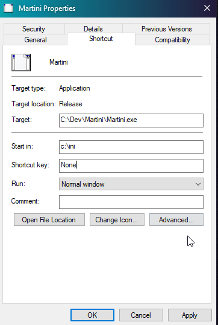
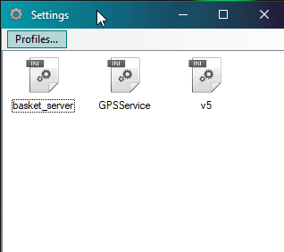
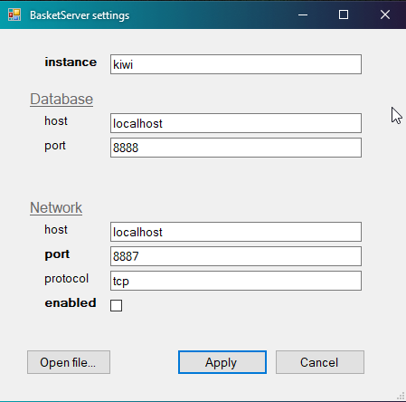

# Martini

Martini is an *ini* file manager.

It has been designed to simplify the management of multiple versions of a
set of *ini* files as is often the case for a developper or tester. One
has to change the database, host names, ports, etc.

A common way of adressing this situation is commenting and uncommenting
lines in the ini files, but this makes for some pretty messy files, especially
when you have more than a few variables and environments.

Martini uses the lines starting with `#` as special comments defining the
default values for the various sections and keys allowed in the ini file.
It will force the content of the ini file to be complient with this
help information.

Default values of *true* or *false* are interpreted as booleans and
a checkbox is used to toggle their values.

Martini consists of a single executable and has no configuration of its own.
All *ini* files are read from the current directory, so the best way to
use it is to place the executable somewhere in the path and call it from
the *ini* directory or to create a Windows shortcut specifying the working
directory to where the *ini* files live.

You can attach a tooltip to a key by writing it on the line above and
bounding it with curly braces as shown here:

``` ini
# {This is a comment for the next key}
# key = value
```

Only the *ini* files matching the proper syntax will be managed through Martini (see example below)

# Profiles

Martini allows you to create a copy of all Martini files in a single profile file.
It really is only a *zip* file with the *.martini* extention.

Files are restored, from *.martini* profiles through the *Profile* menu.

# Martini syntax example


*basket_server.ini*

``` ini
#
# instance=banana
#
# [database]
# host=localhost
# port=8888
#
# [network]
# host=localhost
# port=8888
# enabled=true
#

instance=kiwi

[database]
host=localhost
port=8888

[network]
host=localhost
port=8887
enabled=false
```

# Screenshots







