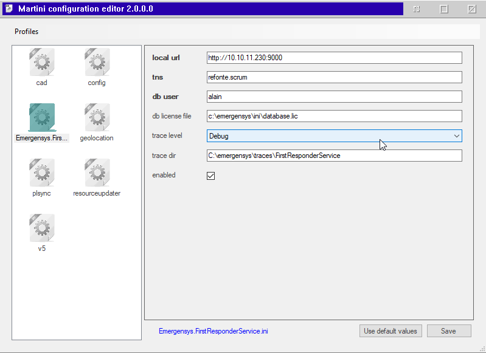
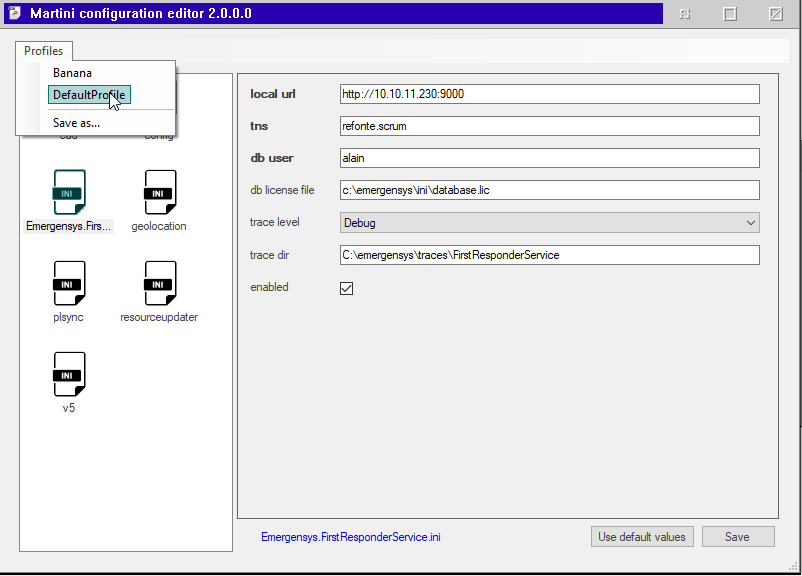

# Martini

Martini is an *ini* file manager.

It has been designed to simplify the management of multiple versions of a
set of *ini* files in scenarios where those files are often modified, e.g. 
when testing on multiple environments.

A common way of adressing these scenarios is often to modify the files 
manually, mainting multiple commented values or replacing files manually with copies. This is messy an prone to errors.

Martini uses the lines starting with `#` as special comments defining the
default values for the various sections and keys allowed in the ini file.
It will force the content of the ini file to be complient with this
help information.

- Default values of *true* or *false* are interpreted as booleans and a checkbox is used to toggle their values.
- Bold keys indicate that the current is different than the default.
- Comments may be used to specify a list of legal values for a given key (see below).

Martini consists of a single executable and has no configuration of its own.
All *ini* files are read from the current directory, so the best way to
use it is to place the executable somewhere in the path and call it from
the *ini* directory or to create a Windows shortcut specifying the working
directory to where the *ini* files live.

You can attach a note, which will appear as a tooltip, to a key by 
writing it on the line above and bounding it with curly braces as shown here:

``` ini
# {This is a note for the next key}
# key = value
```

You can restrict value selection to a set of allowed values by placing 
them between `<` and `>` characters, above the key. Possible values must 
be separated by the pipe character ('|') as shown below:

``` ini
# {Note about key...}
# <Error|Warning|Info|Debug|Verbose>
# trace = Info
```

Only the *ini* files containing Martini comments will be managed 
through Martini, and thus appear in the list view.

# Snapshots

Snapshots allow you to manage multiple versions of your *ini* files. 
A snapshot is created using the *Save snapshots as...* submenu. All 
the ini files present in the list view are then packaged in a single 
zip file using the desired name.

To restore a snapshot, simply select it under the *Snapshots* menu. 
The files in the archive will be extracted to replace the
ones currently in the *ini* directory.

# Martini syntax example

``` ini
#
# instance=
#
# [database]
# host=localhost
# port=8888
#
# [network]
# host=localhost
# port=7777
# enabled=true
#

instance=Greenland

[database]
host=localhost
port=8888

[network]
host=localhost
port=2899
enabled=false
```

# Hotkeys

- `Esc` Quit application.
- `F4` Toggle file view.


# Screenshots

Main window:



Known snapshots:


